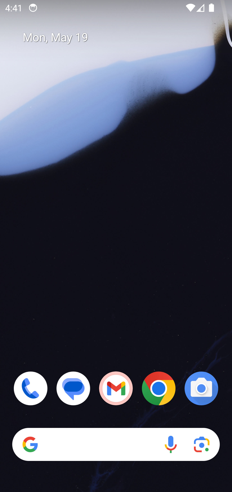
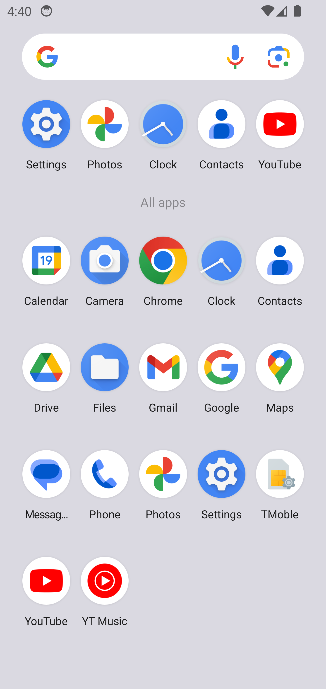

## Prerequisites

Before running the examples, make sure you have the following installed:

- Node.js >= 16.0.0 (LTS version recommended)
- npm (comes with Node.js)
- Git

## How to use

### Step 1: Get your API Key
1. Visit https://alpha.gbox.cloud/api-keys
2. Get your GBOX API KEY

### Step 2: Run the example
```bash
git clone git@github.com:babelcloud/gbox-sdk-alpha.git

# Install dependencies
<<<<<<< HEAD
cd example & npm i
=======
cd gbox-sdk-alpha && npm i
>>>>>>> ef96527751f1f7780e90348bc157eb439898a61c

# Update up your GBOX API KEY on .env file
GBOX_API_KEY=xxxxx

<<<<<<< HEAD
# Run the android gbox
npm run start:android
=======
# Run the android gbox example
cd example && npm run start
>>>>>>> ef96527751f1f7780e90348bc157eb439898a61c

# Run the terminal gbox
npm run start:terminal

# WIP: Run the broswer gbox
npm run start:browser
```
Then, you will see the Android interface automatically simulate E2E testing, such as clicking, typing, and searching operations.

Enjoy your android simulator!

### Screenshot
- Click and type text


- Before drag



- After drag




### TODO
- Google search E2E
- Work with OpenAI computer use