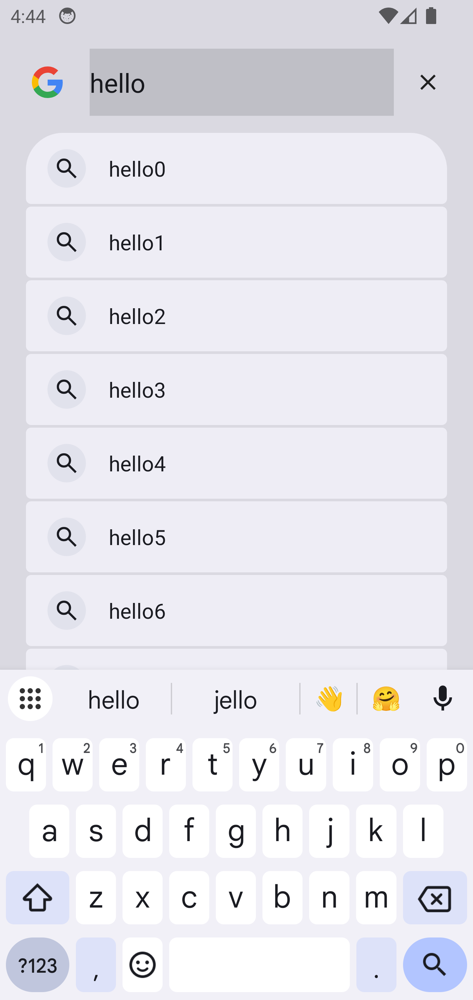
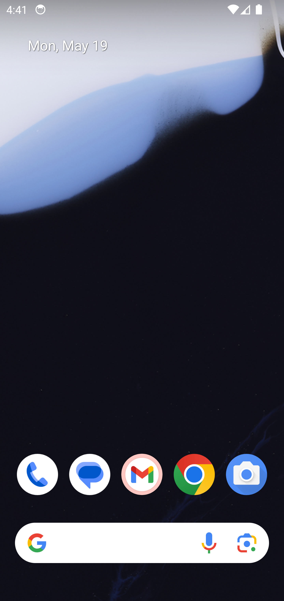
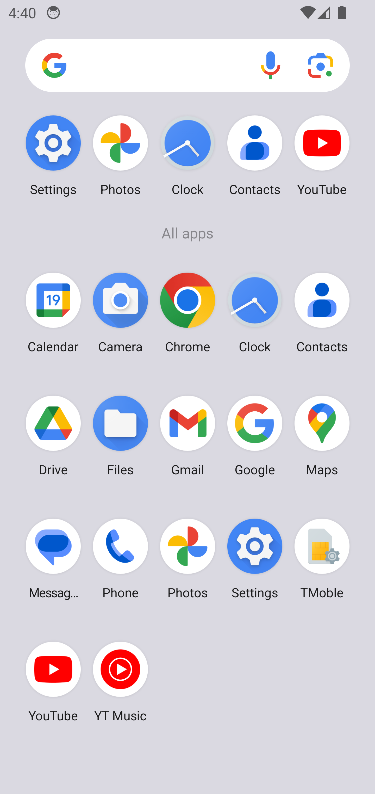

## How to use

### Step 1: Get your API Key
1. Visit https://gboxes.app/api-keys
2. Get your GBOX API KEY

### Step 2: Run the example
```bash
git clone git@github.com:h8r-dev/gbox-sdk.git

cd example

# Install dependencies
npm i

# Set up your GBOX API KEY
export GBOX_API_KEY=xxx

# Run the example
node basic/android.ts
```

Enjoy your android simulator!

### Screenshot
- Click and type text


- Before drag



- After drag



### TODO
- Google search E2E
- Work with OpenAI computer use